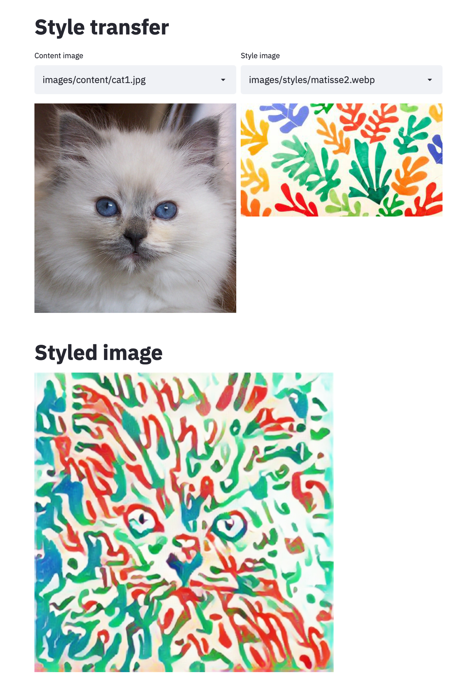

Style transfer UI with Streamlit
================================

This repo provide an easy to use interface to perform neural style transfer ([details](https://arxiv.org/abs/1705.06830)), it looks like:



## Installing dependencies

This project requires python3.5 or above. Run the following command to install the requirements:
```bash
pip install -r requirements.tx
```

## Usage
Start interface with:

```bash
streamlit run ui.py
```

Add extra image content or styles in the `images` folder.
